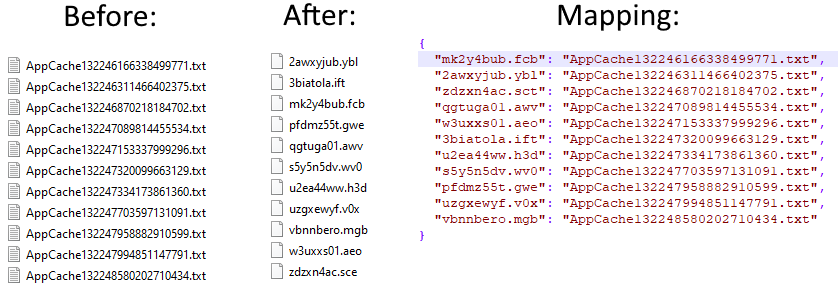

# FilenameObfuscator
 Program for obfuscating file names

## Usage

To obfuscate a directory:

```console
FilenameObfuscator obfuscate -directory <path> -mapping <path_to_mapping>
```

To deobfuscate a directory:

```console
FilenameObfuscator deobfuscate -directory <path> -mapping <path_to_mapping>
```

To get extended help:
```console
FilenameObfuscator --help
FilenameObfuscator obfuscate --help
FilenameObfuscator deobfuscate --help
```

 ## Visualization


